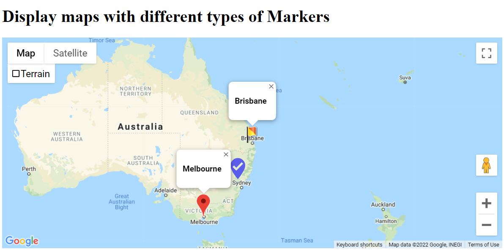

# Google Maps API to display map with different types of markers for multiple locations

## Requirements
- Create your own Google API key and update `YOUR_API_KEY` in the index.html
    - https://developers.google.com/maps/documentation/javascript/get-api-key

- Use HTML, Javascript and CSS to create Map and markers

### Different map locations with multiple markers

